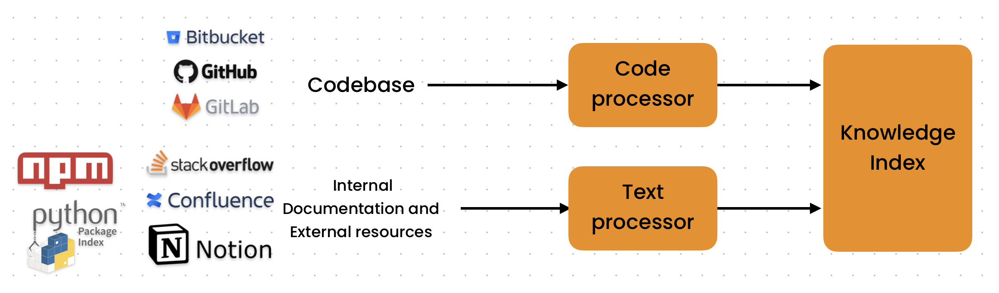
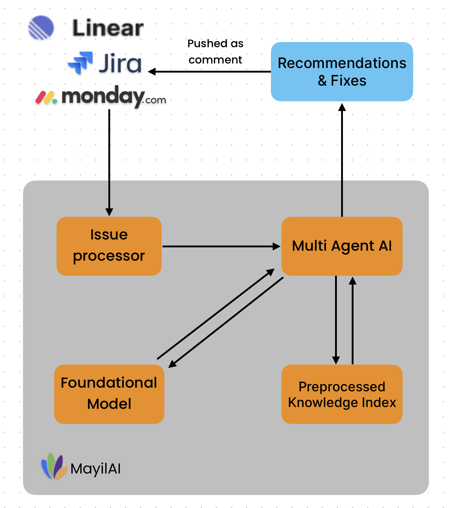
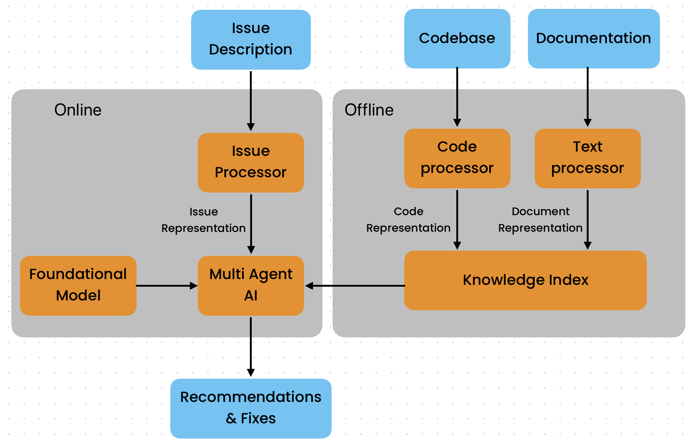

Mayil is designed to run in 2 phases:

 1. **Offline Indexing**- One-time data ingestion step
 2. **Online Inference**- Real-time inference that runs day-to-day to help developers

## Offline Indexing

A project's codebase from a git provider and documentation from various sources are ingested into Mayil's knowledge index.

This is a one-time step that is done before the system is deployed and can take anywhere from 20 minutes to 2 hours.

Custom data ingestion interfaces can be easily built for company-specific data sources such as custom wikis, databases, etc. Please contact us to learn more.

## Online Inference

Once the knowledge index is built, Mayil is ready to run! Mayil interfaces with your team's issue tracking and runs whenever a new ticket is created.

It uses the information in the ticket to understand the issue and uses AI to come up with potential solutions and helpful hints.

Mayil then pushes these changes as comments to the ticket.

## Mayil's Information Retrieval Architecture

+ Mayil **does not train or fine-tune** foundational models. It simply uses them as a tool for semantic understanding and natural language processing.
+ Mayil has a custom code ingestion mechanism that builds an abstract syntax tree of the code and indexes data using the AST to create logically independent knowledge units.
+ Reindexing of data needs to be done regularly to keep the knowledge index up to date. This is automatically done.

